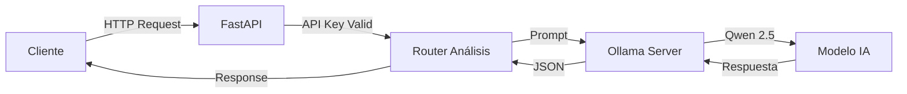

# 🤖 Qwen API

<div align="center">


**API REST profesional para análisis de texto con Inteligencia Artificial**

[Instalación](#-instalación) • [Uso](#-uso) • [Endpoints](#-endpoints) • [Configuración](#-configuración)

</div>

---

## 📋 Descripción del Proyecto

**Qwen API** es una API REST construida con FastAPI que proporciona servicios de análisis de texto utilizando el modelo de lenguaje **Qwen 2.5** ejecutado localmente a través de **Ollama**. 

### ¿Qué puede hacer?

| Tarea | Descripción |
|-------|-------------|
| 🔍 **Analizar** | Análisis detallado de cualquier texto |
| 📝 **Resumir** | Resume textos largos de manera concisa |
| 😊 **Sentimiento** | Detecta si el texto es positivo, negativo o neutral |
| 💡 **Extraer** | Extrae las ideas principales y conceptos clave |
| 🏷️ **Keywords** | Identifica las palabras clave más importantes |

### Características Principales

- ✅ **100% Local** - No requiere conexión a APIs externas de IA
- ✅ **Privacidad Total** - Tus datos nunca salen de tu servidor
- ✅ **Dockerizado** - Despliegue fácil con Docker Compose
- ✅ **Autenticación** - Protección con API Key
- ✅ **Documentación Automática** - Swagger UI y ReDoc incluidos
- ✅ **Procesamiento Batch** - Analiza múltiples textos en una sola petición

---

## 🏗️ Arquitectura



### Estructura del Proyecto

```
qwen-api/
├── 📄 docker-compose.yml    # Orquestación de contenedores
├── 📄 .env                  # Variables de entorno (no subir a git)
├── 📄 .env.example          # Plantilla de configuración
├── 📄 requirements.txt      # Dependencias Python
│
└── 📁 api/
    ├── 📄 Dockerfile        # Imagen Docker de la API
    │
    └── 📁 app/
        ├── 📄 __init__.py       # Paquete principal
        ├── 📄 main.py           # Punto de entrada FastAPI
        ├── 📄 config.py         # Configuración con Pydantic
        ├── 📄 models.py         # Modelos de request/response
        ├── 📄 dependencies.py   # Autenticación API Key
        │
        └── 📁 routers/
            ├── 📄 __init__.py   # Paquete de routers
            ├── 📄 health.py     # Endpoint de salud
            └── 📄 analisis.py   # Endpoints de análisis
```

---

## 🛠️ Tecnologías Utilizadas

| Tecnología | Versión | Propósito |
|------------|---------|-----------|
| **Python** | 3.11 | Lenguaje de programación |
| **FastAPI** | 0.104.1 | Framework web asíncrono |
| **Uvicorn** | 0.24.0 | Servidor ASGI de alto rendimiento |
| **Pydantic** | 2.5.0 | Validación de datos |
| **Ollama** | 0.1.6 | Cliente para servidor de modelos |
| **Docker** | Latest | Contenedorización |
| **Qwen 2.5** | 3B | Modelo de lenguaje |

---

## 📦 Instalación

### Prerrequisitos

- **Docker Desktop** instalado y ejecutándose
- **Git** (opcional, para clonar el repositorio)
- Mínimo **8 GB de RAM** disponibles
- Mínimo **10 GB de espacio en disco**

### Paso 1: Clonar/Descargar el Proyecto

```bash
# Opción A: Clonar con Git
git clone https://github.com/tu-usuario/qwen-api.git
cd qwen-api

# Opción B: Descargar y extraer el ZIP
```

### Paso 2: Configurar Variables de Entorno

```bash
# Crear archivo .env desde la plantilla
cp .env.example .env

# Editar con tu editor favorito
notepad .env  # Windows
nano .env     # Linux/Mac
```

**Configuración mínima requerida en `.env`:**

```env
# ¡IMPORTANTE! Cambia esta clave por una segura
API_KEY=tu_clave_secreta_aqui

# Deja el resto con valores por defecto o ajusta según necesites
API_PORT=8000
MODEL_NAME=qwen2.5:3b
```

### Paso 3: Iniciar los Servicios

```bash
# Construir e iniciar los contenedores
docker-compose up -d --build
```

> ⏳ **Nota:** La primera ejecución puede tardar varios minutos mientras descarga el modelo Qwen 2.5 (~2GB).

### Paso 4: Verificar la Instalación

```bash
# Verificar que los contenedores están corriendo
docker-compose ps

# Probar el endpoint de salud
curl http://localhost:8000/health
```

**Respuesta esperada:**
```json
{
  "status": "healthy",
  "modelo": "qwen2.5:3b",
  "ollama_conectado": true,
  "version": "1.0.0"
}
```

### Paso 5: Descargar el Modelo (si no se descargó automáticamente)

```bash
# Entrar al contenedor de Ollama
docker exec -it qwen-ollama ollama pull qwen2.5:3b
```

---

## 🚀 Uso

### Acceder a la Documentación

Una vez iniciada la API, accede a la documentación interactiva:

| URL | Descripción |
|-----|-------------|
| http://localhost:8000/docs | Swagger UI (interactivo) |
| http://localhost:8000/redoc | ReDoc (documentación) |
| http://localhost:8000/ | Información básica |

### Ejemplos de Uso con cURL

#### 1. Análisis de Texto

```bash
curl -X POST "http://localhost:8000/api/v1/analizar" \
  -H "Content-Type: application/json" \
  -H "X-API-Key: tu_api_key" \
  -d '{
    "texto": "La inteligencia artificial está revolucionando todos los sectores de la economía.",
    "tarea": "analizar",
    "temperatura": 0.7,
    "max_tokens": 512
  }'
```

#### 2. Análisis de Sentimiento

```bash
curl -X POST "http://localhost:8000/api/v1/analizar" \
  -H "Content-Type: application/json" \
  -H "X-API-Key: tu_api_key" \
  -d '{
    "texto": "¡Me encanta este producto! Es increíble y funciona perfectamente.",
    "tarea": "sentimiento"
  }'
```

#### 3. Extracción de Keywords

```bash
curl -X POST "http://localhost:8000/api/v1/analizar" \
  -H "Content-Type: application/json" \
  -H "X-API-Key: tu_api_key" \
  -d '{
    "texto": "Python es un lenguaje de programación interpretado de alto nivel con tipado dinámico.",
    "tarea": "keywords"
  }'
```

#### 4. Procesamiento Batch

```bash
curl -X POST "http://localhost:8000/api/v1/batch" \
  -H "Content-Type: application/json" \
  -H "X-API-Key: tu_api_key" \
  -d '{
    "textos": [
      "Primer texto a analizar",
      "Segundo texto a analizar",
      "Tercer texto a analizar"
    ],
    "tarea": "resumir"
  }'
```

### Ejemplos con Python

```python
import requests

# Configuración
API_URL = "http://localhost:8000/api/v1/analizar"
API_KEY = "tu_api_key"

# Headers de autenticación
headers = {
    "Content-Type": "application/json",
    "X-API-Key": API_KEY
}

# Datos de la petición
data = {
    "texto": "Tu texto a analizar aquí",
    "tarea": "sentimiento",
    "temperatura": 0.7,
    "max_tokens": 512
}

# Realizar petición
response = requests.post(API_URL, json=data, headers=headers)

# Procesar respuesta
if response.status_code == 200:
    resultado = response.json()
    print(f"Estado: {resultado['status']}")
    print(f"Resultado: {resultado['resultado']}")
else:
    print(f"Error: {response.status_code}")
    print(response.text)
```

---

## 📡 Endpoints

### Tabla de Endpoints

| Método | Endpoint | Autenticación | Descripción |
|--------|----------|---------------|-------------|
| `GET` | `/` | ❌ No | Información de la API |
| `GET` | `/health` | ❌ No | Estado del servicio |
| `GET` | `/docs` | ❌ No | Documentación Swagger |
| `GET` | `/redoc` | ❌ No | Documentación ReDoc |
| `POST` | `/api/v1/analizar` | ✅ Sí | Análisis de texto |
| `POST` | `/api/v1/batch` | ✅ Sí | Análisis de múltiples textos |

### Detalle de `/api/v1/analizar`

**Request:**
```json
{
  "texto": "string (1-10000 caracteres)",
  "tarea": "analizar | resumir | sentimiento | extraer | keywords",
  "temperatura": 0.7,
  "max_tokens": 512
}
```

**Response:**
```json
{
  "status": "success",
  "tarea": "sentimiento",
  "resultado": "El texto tiene un sentimiento positivo...",
  "modelo": "qwen2.5:3b",
  "tokens_usados": 245
}
```

---

## ⚙️ Configuración

### Variables de Entorno

| Variable | Requerido | Default | Descripción |
|----------|-----------|---------|-------------|
| `API_KEY` | ✅ Sí | - | Clave de autenticación |
| `API_PORT` | ❌ No | 8000 | Puerto de la API |
| `API_HOST` | ❌ No | 0.0.0.0 | Host de la API |
| `OLLAMA_HOST` | ❌ No | ollama | Host de Ollama |
| `OLLAMA_PORT` | ❌ No | 11434 | Puerto de Ollama |
| `MODEL_NAME` | ❌ No | qwen2.5:3b | Modelo a usar |
| `OLLAMA_NUM_THREADS` | ❌ No | 8 | Threads para Ollama |
| `OLLAMA_MAX_LOADED_MODELS` | ❌ No | 1 | Modelos en memoria |

### Modelos Disponibles

Puedes cambiar el modelo en `.env`. Opciones recomendadas:

| Modelo | RAM Necesaria | Velocidad | Calidad |
|--------|---------------|-----------|---------|
| `qwen2.5:0.5b` | 2 GB | ⚡⚡⚡ | ⭐⭐ |
| `qwen2.5:1.5b` | 3 GB | ⚡⚡⚡ | ⭐⭐⭐ |
| `qwen2.5:3b` | 4 GB | ⚡⚡ | ⭐⭐⭐⭐ |
| `qwen2.5:7b` | 8 GB | ⚡ | ⭐⭐⭐⭐⭐ |

---

## 🔧 Comandos Útiles

```bash
# Ver logs en tiempo real
docker-compose logs -f

# Ver logs solo de la API
docker-compose logs -f api

# Reiniciar servicios
docker-compose restart

# Detener servicios
docker-compose down

# Detener y eliminar volúmenes (¡borra el modelo descargado!)
docker-compose down -v

# Reconstruir después de cambios
docker-compose up -d --build

# Entrar al contenedor de la API
docker exec -it qwen-api bash

# Entrar al contenedor de Ollama
docker exec -it qwen-ollama bash

# Ver modelos instalados en Ollama
docker exec -it qwen-ollama ollama list

# Descargar otro modelo
docker exec -it qwen-ollama ollama pull llama3:8b
```

---

## 🔒 Seguridad

### Recomendaciones para Producción

1. **Cambiar la API Key** por una clave segura y aleatoria
2. **Configurar CORS** con dominios específicos en `main.py`
3. **Usar HTTPS** con un proxy reverso (Nginx, Traefik)
4. **Implementar rate limiting** para prevenir abuso
5. **No exponer puertos** directamente a internet sin firewall

### Ejemplo de API Key Segura

```bash
# Generar una API Key segura con Python
python -c "import secrets; print(secrets.token_urlsafe(32))"
```

---

## 🐛 Solución de Problemas

### Error: "Servicio no disponible"

```bash
# Verificar que Ollama está corriendo
docker-compose ps

# Ver logs de Ollama
docker-compose logs ollama

# Reiniciar Ollama
docker-compose restart ollama
```

### Error: "Modelo no encontrado"

```bash
# Descargar el modelo manualmente
docker exec -it qwen-ollama ollama pull qwen2.5:3b

# Verificar modelos instalados
docker exec -it qwen-ollama ollama list
```

### Error: "API Key inválida"

- Verificar que el header es `X-API-Key` (con guiones)
- Confirmar que el valor coincide con el de `.env`
- Reiniciar la API después de cambiar `.env`

---

## 📄 Licencia

Este proyecto está bajo la Licencia MIT. Consulta el archivo `LICENSE` para más detalles.

---

<div align="center">

**Desarrollado con ❤️ usando FastAPI y Ollama**

</div>
