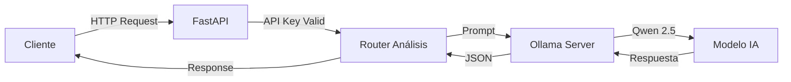

#  Qwen API

**API REST profesional para análisis de texto con Inteligencia Artificial**

[Instalación](#-instalación) • [Uso](#-uso) • [Endpoints](#-endpoints) • [Configuración](#-configuración)

</div>

---

##  Descripción del Proyecto

**Qwen API - Clasificador de Procesos Legales** es una API REST construida con FastAPI que clasifica procesos judiciales del Consejo de Estado colombiano relacionados con DOLMEN o alumbrado público, utilizando el modelo de lenguaje **Qwen 2.5** ejecutado localmente a través de **Ollama**. 

### ¿Qué puede hacer?

| Tarea | Descripción |
|-------|-------------|
| ⚖️ **Clasificar Procesos Legales** | Clasifica procesos judiciales del Consejo de Estado colombiano relacionados con DOLMEN o alumbrado público |

### Características Principales

-  **100% Local** - No requiere conexión a APIs externas de IA
-  **Privacidad Total** - Tus datos nunca salen de tu servidor
-  **Dockerizado** - Despliegue fácil con Docker Compose
-  **Autenticación** - Protección con API Key
-  **Documentación Automática** - Swagger UI y ReDoc incluidos
-  **Clasificación Inteligente** - Análisis preciso con niveles de confianza

---

##  Arquitectura



### Estructura del Proyecto

```
qwen-api/
├──  docker-compose.yml    # Orquestación de contenedores
├──  .env                  # Variables de entorno (no subir a git)
├──  .env.example          # Plantilla de configuración
├──  requirements.txt      # Dependencias Python
│
└──  api/
    ├──  Dockerfile        # Imagen Docker de la API
    │
    └──  app/
        ├──  __init__.py       # Paquete principal
        ├──  main.py           # Punto de entrada FastAPI
        ├──  config.py         # Configuración con Pydantic
        ├──  models.py         # Modelos de request/response
        ├──  dependencies.py   # Autenticación API Key
        │
        └──  routers/
            ├──  __init__.py   # Paquete de routers
            ├──  health.py     # Endpoint de salud
            └──  analisis.py   # Endpoints de análisis
```

---

##  Tecnologías Utilizadas

| Tecnología | Versión | Propósito |
|------------|---------|-----------|
| **Python** | 3.11 | Lenguaje de programación |
| **FastAPI** | 0.104.1 | Framework web asíncrono |
| **Uvicorn** | 0.24.0 | Servidor ASGI de alto rendimiento |
| **Pydantic** | 2.5.0 | Validación de datos |
| **Ollama** | 0.1.6 | Cliente para servidor de modelos |
| **Docker** | Latest | Contenedorización |
| **Qwen 2.5** | 3B | Modelo de lenguaje |

---

##  Instalación

### Prerrequisitos

- **Docker Desktop** instalado y ejecutándose
- **Git** (opcional, para clonar el repositorio)
- Mínimo **8 GB de RAM** disponibles
- Mínimo **10 GB de espacio en disco**

### Paso 1: Clonar/Descargar el Proyecto

```bash
# Opción A: Clonar con Git
git clone https://github.com/tu-usuario/qwen-api.git
cd qwen-api

# Opción B: Descargar y extraer el ZIP
```

### Paso 2: Configurar Variables de Entorno

```bash
# Crear archivo .env desde la plantilla
cp .env.example .env

# Editar con tu editor favorito
notepad .env  # Windows
nano .env     # Linux/Mac
```

**Configuración mínima requerida en `.env`:**

```env
# ¡IMPORTANTE! Cambia esta clave por una segura
API_KEY=tu_clave_secreta_aqui

# Deja el resto con valores por defecto o ajusta según necesites
API_PORT=8000
MODEL_NAME=qwen2.5:3b
```

### Paso 3: Iniciar los Servicios

```bash
# Construir e iniciar los contenedores
docker-compose up -d --build
```

> ⏳ **Nota:** La primera ejecución puede tardar varios minutos mientras descarga el modelo Qwen 2.5 (~2GB).

### Paso 4: Verificar la Instalación

```bash
# Verificar que los contenedores están corriendo
docker-compose ps

# Probar el endpoint de salud
curl http://localhost:8000/health
```

**Respuesta esperada:**
```json
{
  "status": "healthy",
  "modelo": "qwen2.5:3b",
  "ollama_conectado": true,
  "version": "1.0.0"
}
```

### Paso 5: Descargar el Modelo (si no se descargó automáticamente)

```bash
# Entrar al contenedor de Ollama
docker exec -it qwen-ollama ollama pull qwen2.5:3b
```

---

##  Uso

### Acceder a la Documentación

Una vez iniciada la API, accede a la documentación interactiva:

| URL | Descripción |
|-----|-------------|
| http://localhost:8000/docs | Swagger UI (interactivo) |
| http://localhost:8000/redoc | ReDoc (documentación) |
| http://localhost:8000/ | Información básica |

---

##  Endpoints

### Tabla de Endpoints

| Método | Endpoint | Autenticación | Descripción |
|--------|----------|---------------|-------------|
| `GET` | `/` | ❌ No | Información de la API |
| `GET` | `/health` | ❌ No | Estado del servicio |
| `GET` | `/docs` | ❌ No | Documentación Swagger |
| `GET` | `/redoc` | ❌ No | Documentación ReDoc |
| `POST` | `/api/v1/clasificar` | ✅ Sí | Clasificación de procesos legales |

### Detalle de `/api/v1/clasificar`

⚖️ **Endpoint especializado para clasificar procesos legales del Consejo de Estado colombiano**

Este endpoint determina si un proceso judicial está relacionado con la empresa **DOLMEN** o con servicios de **alumbrado público**. Utiliza criterios específicos para evaluar la relevancia y proporciona un nivel de confianza de la clasificación.

#### Criterios de Clasificación

**RELEVANTE cuando:**
- Menciona explícitamente a DOLMEN (empresa de alumbrado público)
- Se trata de servicios de alumbrado público, iluminación pública o luminarias
- Involucra contratos, obligaciones o reclamaciones sobre alumbrado público
- Menciona postes de luz o servicios de iluminación urbana/residencial
- Reclamos por cobros o facturación de alumbrado público

**NO RELEVANTE cuando:**
- Procesos sobre otros servicios públicos (agua, gas, alcantarillado, energía residencial)
- Demandas administrativas sin relación con alumbrado
- Procesos laborales, penales o civiles sin mención de alumbrado público
- Menciones figurativas como "a la luz de los hechos"

#### Niveles de Confianza

| Rango | Significado |
|-------|-------------|
| 0.9 - 1.0 | Mención explícita de DOLMEN o múltiples términos de alumbrado público |
| 0.7 - 0.89 | Clara relación con alumbrado público sin mencionar DOLMEN |
| 0.5 - 0.69 | Relación probable pero con ambigüedad |
| 0.3 - 0.49 | Relación dudosa o muy indirecta |
| 0.0 - 0.29 | No hay relación aparente |

#### Request

```json
{
  "texto": "string (mínimo 10 caracteres)",
  "metadatos": {
    "demandante": "string (opcional)",
    "demandado": "string (opcional)"
  }
}
```

**Parámetros:**
- `texto` *(requerido)*: Texto completo del proceso judicial a clasificar
- `metadatos` *(opcional)*: Información adicional del proceso (demandante, demandado, etc.)

#### Response

```json
{
  "es_relevante": true,
  "confianza": 0.98,
  "razon": "Menciona explícitamente a DOLMEN y reclamos por alumbrado público"
}
```

**Campos de respuesta:**
- `es_relevante` *(boolean)*: `true` si está relacionado con DOLMEN/alumbrado público, `false` en caso contrario
- `confianza` *(float)*: Nivel de confianza de la clasificación (0.0 a 1.0)
- `razon` *(string)*: Explicación breve de la clasificación (máximo 150 caracteres)

#### Ejemplos de Uso

**Ejemplo 1: Proceso RELEVANTE (Alta confianza)**

```bash
curl -X POST "http://localhost:8000/api/v1/clasificar" \
  -H "Content-Type: application/json" \
  -H "X-API-Key: tu_api_key" \
  -d '{
    "texto": "El demandante reclama por cobros excesivos del servicio de alumbrado público facturados por la empresa DOLMEN durante los años 2020-2023. Se solicita la devolución de los pagos indebidos por concepto de luminarias no instaladas en el sector.",
    "metadatos": {
      "demandante": "JUAN PEREZ",
      "demandado": "MUNICIPIO DE BOGOTA"
    }
  }'
```

**Respuesta esperada:**
```json
{
  "es_relevante": true,
  "confianza": 0.98,
  "razon": "Menciona explícitamente a DOLMEN y reclamos por cobros de alumbrado público"
}
```

**Ejemplo 2: Proceso NO RELEVANTE**

```bash
curl -X POST "http://localhost:8000/api/v1/clasificar" \
  -H "Content-Type: application/json" \
  -H "X-API-Key: tu_api_key" \
  -d '{
    "texto": "El demandante solicita el reconocimiento de prestaciones sociales derivadas de su contrato laboral con la empresa municipal de acueducto. Se reclama el pago de cesantías e intereses.",
    "metadatos": {
      "demandante": "PEDRO GOMEZ",
      "demandado": "EMPRESA DE ACUEDUCTO"
    }
  }'
```

**Respuesta esperada:**
```json
{
  "es_relevante": false,
  "confianza": 0.95,
  "razon": "Proceso laboral sobre acueducto, sin relación con alumbrado público o DOLMEN"
}
```

**Ejemplo 3: Caso AMBIGUO (Confianza Media-Baja)**

```bash
curl -X POST "http://localhost:8000/api/v1/clasificar" \
  -H "Content-Type: application/json" \
  -H "X-API-Key: tu_api_key" \
  -d '{
    "texto": "A la luz de los hechos probados en el expediente, se concluye que la administración actuó correctamente en el proceso de contratación del servicio de aseo urbano."
  }'
```

**Respuesta esperada:**
```json
{
  "es_relevante": false,
  "confianza": 0.92,
  "razon": "Menciona 'luz' en contexto figurativo, trata sobre servicio de aseo"
}
```

#### Uso en Python

```python
import requests

# Configuración
API_URL = "http://localhost:8000/api/v1/clasificar"
API_KEY = "tu_api_key"

# Headers
headers = {
    "Content-Type": "application/json",
    "X-API-Key": API_KEY
}

# Datos del proceso legal
data = {
    "texto": "El demandante reclama por cobros de alumbrado público por DOLMEN...",
    "metadatos": {
        "demandante": "JUAN PEREZ",
        "demandado": "MUNICIPIO"
    }
}

# Realizar clasificación
response = requests.post(API_URL, json=data, headers=headers)

if response.status_code == 200:
    resultado = response.json()
    print(f"Es relevante: {resultado['es_relevante']}")
    print(f"Confianza: {resultado['confianza']}")
    print(f"Razón: {resultado['razon']}")
else:
    print(f"Error: {response.status_code}")
    print(response.text)
```

#### Casos de Uso

- **Filtrado automático** de procesos judiciales relacionados con DOLMEN
- **Clasificación masiva** de expedientes del Consejo de Estado
- **Priorización** de casos por relevancia y confianza
- **Auditoría** de facturación de alumbrado público
- **Monitoreo** de procesos administrativos relacionados

---

##  Configuración

### Variables de Entorno

| Variable | Requerido | Default | Descripción |
|----------|-----------|---------|-------------|
| `API_KEY` | ✅ Sí | - | Clave de autenticación |
| `API_PORT` | ❌ No | 8000 | Puerto de la API |
| `API_HOST` | ❌ No | 0.0.0.0 | Host de la API |
| `OLLAMA_HOST` | ❌ No | ollama | Host de Ollama |
| `OLLAMA_PORT` | ❌ No | 11434 | Puerto de Ollama |
| `MODEL_NAME` | ❌ No | qwen2.5:3b | Modelo a usar |
| `OLLAMA_NUM_THREADS` | ❌ No | 8 | Threads para Ollama |
| `OLLAMA_MAX_LOADED_MODELS` | ❌ No | 1 | Modelos en memoria |


##  Comandos Útiles

```bash
# Ver logs en tiempo real
docker-compose logs -f

# Ver logs solo de la API
docker-compose logs -f api

# Reiniciar servicios
docker-compose restart

# Detener servicios
docker-compose down

# Detener y eliminar volúmenes (¡borra el modelo descargado!)
docker-compose down -v

# Reconstruir después de cambios
docker-compose up -d --build

# Entrar al contenedor de la API
docker exec -it qwen-api bash

# Entrar al contenedor de Ollama
docker exec -it qwen-ollama bash

# Ver modelos instalados en Ollama
docker exec -it qwen-ollama ollama list

# Descargar otro modelo
docker exec -it qwen-ollama ollama pull llama3:8b
```

---

##  Seguridad

### Recomendaciones para Producción

1. **Cambiar la API Key** por una clave segura y aleatoria
2. **Configurar CORS** con dominios específicos en `main.py`
3. **Usar HTTPS** con un proxy reverso (Nginx, Traefik)
4. **Implementar rate limiting** para prevenir abuso
5. **No exponer puertos** directamente a internet sin firewall

### Ejemplo de API Key Segura

```bash
# Generar una API Key segura con Python
python -c "import secrets; print(secrets.token_urlsafe(32))"
```

---

##  Solución de Problemas

### Error: "Servicio no disponible"

```bash
# Verificar que Ollama está corriendo
docker-compose ps

# Ver logs de Ollama
docker-compose logs ollama

# Reiniciar Ollama
docker-compose restart ollama
```

### Error: "Modelo no encontrado"

```bash
# Descargar el modelo manualmente
docker exec -it qwen-ollama ollama pull qwen2.5:3b

# Verificar modelos instalados
docker exec -it qwen-ollama ollama list
```

### Error: "API Key inválida"

- Verificar que el header es `X-API-Key` (con guiones)
- Confirmar que el valor coincide con el de `.env`
- Reiniciar la API después de cambiar `.env`

